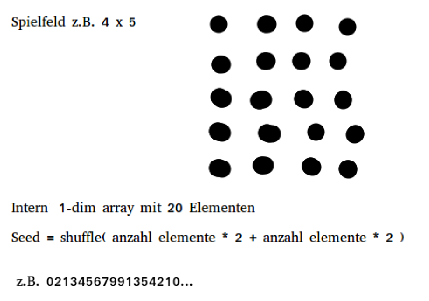
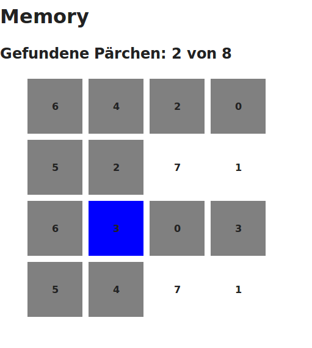

# Memory Pair Programming Session

Powered by Angular Seed.

## Getting started

```bash
git clone https://github.com/mihaeu/tmp-pairing
cd tmp-pairing

# install dependencies (Node v0.12.7, Bower 2.11.3)
npm install
bower install

# start server
npm start

# or: if you have nodemon installed (npm install -g nodemon)
# nodemon bin/www
```

## To Do

 - Clean up (directive for card)
 - Jasmine and Karma

## Idea



1-dim array displayed as a 2-dim array.

## v0.1



No pictures, no real memory, but functionality all there.